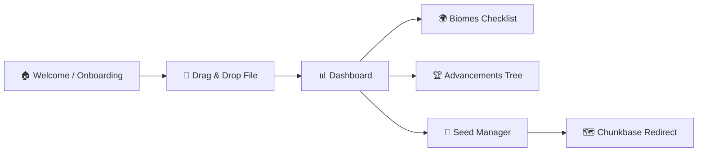

# 🗺️ Minecraft Progress Tracker — Architecture & Implementation Plan

> **Role:** Software Architect & UI/UX Designer
> **Stack:** Angular 21 (Standalone, Signals, Control Flow) · Tailwind CSS · TypeScript
> **License:** MIT (Open Source)

---

## 1. 📖 Project Vision

### The Problem

Players trying to complete all Minecraft achievements (especially *"Adventuring Time"* or *"Monster Hunter"*) face a major obstacle: **the game doesn't tell you exactly what you're missing.** Existing web tools fulfill a basic function but suffer from:

- Outdated interfaces (circa-2012 aesthetic)
- Hard-to-read pixel fonts
- No data persistence — users must re-upload their save file every session
- Zero integration with seed maps

### The Solution

Build **Minecraft Progress Tracker**, a modern, ultra-fast, UX-first web application that lets players:

| Feature | Description |
|---|---|
| **Effortless Tracking** | Drag-and-drop the local save file (`advancements.json`) to instantly visualize progress. |
| **State Persistence** | Progress is remembered locally across sessions — no accounts, no databases, 100% client-side privacy. |
| **Route Planning** | Enter the world seed to jump to interactive external maps (Chunkbase) and locate missing biomes & structures. |
| **Enjoyable Experience** | A *"Modern Craft"* interface that honors the game's palette while using modern web design standards. |

---

## 2. 🎨 Design System & UI/UX — *"Modern Craft"*

The goal is to move away from illegible pixel typography and create a **clean interface** that evokes the game through color palette and official iconography.

### Color Palette (Tailwind)

| Token | Tailwind Class | Usage |
|---|---|---|
| **Deepslate** (base bg) | `bg-slate-950` | Page background |
| **Cobblestone** (surfaces) | `bg-slate-800` / `bg-slate-900` | Cards, panels |
| **Emerald** (accents) | `text-emerald-400` / `bg-emerald-500` | Progress, highlights, CTAs |
| **Redstone** (alerts) | `text-rose-500` | Errors, missing items |

### Typography

- **Primary font:** [Inter](https://fonts.google.com/specimen/Inter) or [Montserrat](https://fonts.google.com/specimen/Montserrat) — clean, sans-serif, excellent legibility.
- Loaded via Google Fonts CDN.

### UI Principles

1. **Intuitive Drag & Drop** — A large, centered, dashed drop zone on the welcome screen.
2. **Visual Feedback** — Fluid progress bars; cards glow on completion (`hover:ring-2 hover:ring-emerald-400`).
3. **Low Cognitive Load** — Achievements grouped into tabs (*Nether, End, Adventure, Biomes*) instead of an infinite scroll list.

---

## 3. 🏗️ Technical Architecture (Angular 21)

The app is **strictly client-side** (no backend) to guarantee privacy and speed, leveraging Angular Signals for reactive state.

### Directory Structure

```
src/
 ├─ app/
 │  ├─ core/                    # Global services (Parser, LocalStorage, ExtLinkManager)
 │  ├─ shared/                  # Reusable components (buttons, progress bars)
 │  ├─ features/
 │  │  ├─ dashboard/            # General summary & statistics
 │  │  ├─ biomes/               # Interactive biome checklist
 │  │  ├─ advancements/         # Classic achievement tree
 │  │  └─ seed-manager/         # Seed management & Chunkbase redirect
 │  └─ app.routes.ts            # Lazy-loaded routing
 ├─ assets/
 │  ├─ icons/                   # Official PNGs extracted from the .jar
 │  └─ data/
 │     └─ master-advancements.json  # Static DB with descriptions & metadata
```

### State Management (Signals)

Central service: **`ProgressStateService`**

| Signal | Type | Description |
|---|---|---|
| `gameState` | `Signal<AdvancementsJSON>` | Raw JSON from the user's save file |
| `visitedBiomes` | `Computed<string[]>` | Derived from `gameState` |
| `missingBiomes` | `Computed<string[]>` | Comparison of `visitedBiomes` vs. master JSON |
| `userSeed` | `Signal<string>` | World seed — auto-persisted to `localStorage` |

---

## 4. 🚀 User Journey



1. **Onboarding** — Welcome screen explaining how to locate the `UUID.json` file. Prominent drag & drop zone.
2. **Dashboard** — File is parsed, saved to `localStorage`, and general statistics are displayed.
3. **Tactical Navigation** — User enters *"Biomes"* and sees cards with images of missing biomes.
4. **Seed & Map** — Panel where the user enters their seed. A prominent button redirects to Chunkbase in a new tab:
   ```
   https://www.chunkbase.com/apps/seed-map#seed=[SEED]
   ```

---

## 5. 🤝 Community & Open Source

This project is **by the community, for the community**. It will be publicly hosted on GitHub.

- **Contributions:** Anyone can fork the repo, propose UI improvements, add translations, or update the achievement database for new Minecraft versions.
- **Issues & Features:** Users can report bugs or request features directly through GitHub Issues.
- **Transparency:** Being open-source and backend-free guarantees save files are never sent to any external server.

---

## 6. ☕ Support & Donations

Discreet but accessible support options to ensure project longevity:

- **Ko-fi / Buy Me a Coffee** — A small footer button (*"Buy me a Speed Potion ☕"*) for one-time donations.
- **Patreon / Sponsors** — For monthly maintenance supporters.
- **Special Mentions** — An "About" page section listing and thanking code contributors and donors.

---

## 7. 📅 Development Roadmap

### Phase 1: Foundation & Data Extraction

> **Goal:** Set up the project skeleton, extract game assets, and create the master data file.

- [x] **1.1** Create the GitHub repository with `README.md`, `.gitignore`, `LICENSE (MIT)`, and contributing guidelines.
- [x] **1.2** Initialize Angular 21 project with standalone components:
  ```bash
  npx -y @angular/cli@latest new ./ --standalone --style=css --routing --ssr=false --skip-tests
  ```
- [x] **1.3** Install and configure Tailwind CSS for Angular.
- [x] **1.4** Set up the directory structure (`core/`, `shared/`, `features/`, `assets/`).
- [x] **1.5** Configure Google Fonts (Inter) in `index.html` and `styles.css`.
- [x] **1.6** Define the Tailwind theme extension with the *Modern Craft* color palette.
- [x] **1.7** Extract official achievement & biome icons from the Minecraft `.jar` file and place them in `assets/icons/`.
- [x] **1.8** Create `assets/data/master-advancements.json` — the static database containing all achievements with:
  - Advancement ID (namespace key)
  - Display name & description
  - Category (Nether / End / Adventure / Biomes / Husbandry)
  - Icon filename reference
  - Criteria list (for multi-criteria advancements like biomes)

---

### Phase 2: Parsing Engine & State Management

> **Goal:** Build the core services that read the user's save file and manage reactive application state.

- [x] **2.1** Create `core/models/` with TypeScript interfaces:
  - `AdvancementsJSON` — models the raw Minecraft advancements file structure.
  - `MasterAdvancement` — models each entry in `master-advancements.json`.
  - `ProgressSummary` — computed stats (total, completed, percentage per category).
- [x] **2.2** Create `core/services/file-parser.service.ts`:
  - Accepts a `File` object (from drag & drop).
  - Reads content via `FileReader` API.
  - Validates JSON structure and returns typed `AdvancementsJSON`.
  - Throws user-friendly errors for invalid files.
- [x] **2.3** Create `core/services/progress-state.service.ts`:
  - Central Signals store (`gameState`, `visitedBiomes`, `missingBiomes`, `userSeed`).
  - Computed signals that diff user data against `master-advancements.json`.
  - Methods: `loadFromFile()`, `loadFromStorage()`, `clearState()`.
- [x] **2.4** Create `core/services/local-storage.service.ts`:
  - Wrapper for `localStorage` with typed get/set.
  - Auto-persistence of `gameState` and `userSeed`.
  - Handles storage quota errors gracefully.
- [x] **2.5** Write unit tests for `FileParserService` and `ProgressStateService` with sample JSON fixtures.

---

### Phase 3: UI Components & Pages

> **Goal:** Build all user-facing components and assemble the pages.

#### 3A — Shared Components

- [x] **3.1** `shared/components/drop-zone/` — Drag & drop file upload zone with:
  - Dashed border, emerald glow on drag-over.
  - File type validation (`.json` only).
  - Emits parsed `File` to parent.
- [x] **3.2** `shared/components/progress-bar/` — Animated horizontal progress bar with percentage label.
- [x] **3.3** `shared/components/progress-card/` — Card component displaying:
  - Icon, title, description.
  - Completion status (checkmark or missing indicator).
  - Hover glow effect.
- [x] **3.4** `shared/components/category-tabs/` — Tab bar for switching between advancement categories.

#### 3B — Feature Pages

- [ ] **3.5** `features/dashboard/` — **Dashboard Page:**
  - Overall progress ring/donut chart.
  - Per-category progress bars.
  - Quick stats (total advancements, completed, missing).
  - Recent completions list.
- [ ] **3.6** `features/biomes/` — **Biomes Page:**
  - Grid of `ProgressCard` for each biome.
  - Visual distinction between visited ✅ and missing ❌.
  - Filter/search input.
- [ ] **3.7** `features/advancements/` — **Advancements Page:**
  - Tabbed view by category (Nether, End, Adventure, Husbandry).
  - Achievement tree or grid layout.
  - Expandable cards showing criteria progress for multi-step advancements.
- [ ] **3.8** `features/seed-manager/` — **Seed Manager Page:**
  - Text input for the world seed.
  - Validation (numeric or alphanumeric check).
  - *"Open in Chunkbase"* button that constructs and opens the external URL.
  - Seed persisted via `localStorage`.

#### 3C — Layout & Navigation

- [ ] **3.9** Create `app.component.ts` shell layout:
  - Sidebar or top-nav with links to Dashboard, Biomes, Advancements, Seed Manager.
  - Footer with donation link and GitHub repo link.
- [ ] **3.10** Configure `app.routes.ts` with lazy-loaded routes for each feature module.

---

### Phase 4: Welcome Flow & Onboarding

> **Goal:** Craft the first-time user experience.

- [ ] **4.1** Create the **Welcome / Landing page** (`features/welcome/`):
  - Hero section with app title and tagline.
  - Step-by-step instructions on locating the `UUID.json` file (with OS-specific paths).
  - Central `DropZone` component.
  - *"I already have data saved"* link that loads from `localStorage`.
- [ ] **4.2** Implement routing guard: redirect to Welcome if no data exists in `localStorage`, otherwise go to Dashboard.

---

### Phase 5: Polish, Testing & Deployment

> **Goal:** Final touches, quality assurance, and go-live.

- [ ] **5.1** Add responsive design breakpoints (mobile-first: `sm`, `md`, `lg`, `xl`).
- [ ] **5.2** Add subtle animations: card entrance transitions, progress bar fill, tab switches.
- [ ] **5.3** Add an **"About"** page with contributor credits, donation links, and project info.
- [ ] **5.4** Write E2E tests (Cypress or Playwright) for the core user journey.
- [ ] **5.5** Configure deployment to **GitHub Pages** (or Vercel/Netlify):
  - Build script: `ng build --configuration production --base-href /Minecradvance/`
  - GitHub Actions CI/CD workflow for automated deploys on `main` push.
- [ ] **5.6** Final review: accessibility audit (a11y), Lighthouse performance check, cross-browser testing.

---

## 8. 📎 External References

| Resource | URL |
|---|---|
| Chunkbase Seed Map | `https://www.chunkbase.com/apps/seed-map` |
| Minecraft Wiki — Advancements | `https://minecraft.wiki/w/Advancement` |
| Angular 21 Docs | `https://angular.dev` |
| Tailwind CSS Docs | `https://tailwindcss.com/docs` |
